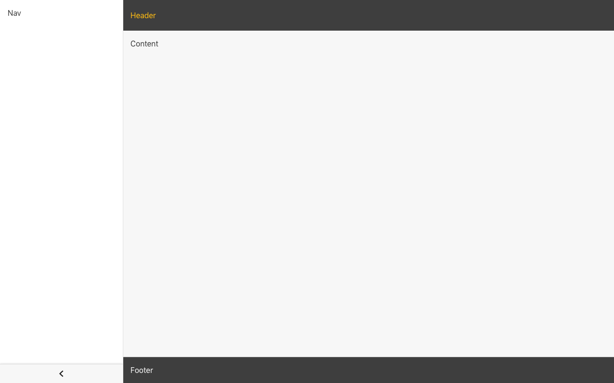

# Committed Components Layout

[](https://committed.io)
[](https://drone.committed.software/commitd/layout)
[](https://committed.software/layout)

This is a simple layout for standard looking material based apps, based on [Mui Layout](https://mui-treasury.com/components/layout)
but using `@committed/components` as its base.

<p align="center">
  
</p>

## 🔗 Live Demo

Here's a [live demo](https://committed.software/docs) using layout and the [storybook](https://committed.software/layout)

## 🚀 Quickstart

For use with [`@committed/components`](https://github.com/commitd/components),

```bash
yarn add @committed/layout
```

add any missing peer dependencies

```bash
yarn add @committed/components @material-ui/core @material-ui/icons react react-dom
```

### Usage

```tsx
import React from 'react'
import ReactDOM from 'react-dom'
import { ThemeProvider } from '@committed/components'
import {
  Root,
  Header,
  Nav,
  NavListItem,
  Content,
  Footer,
  LayoutConfig,
} from '@committed/layout'

const config: Partial<LayoutConfig> = {
  // Only permanently show nav drawer at higher resolutions
  navVariant: {
    sm: 'temporary',
    lg: 'permanent',
  },
}

const App = () => (
  <ThemeProvider theme={theme}>
    <Root config={config}>
      <Header>
        <Typography variant="h5">Application Name</Typography>
      </Header>
      <Nav header={(ctx) => null}>
        <List>
          <NavListItem text="Menu Item 1" icon={<AccountCircle />} />
        </List>
      </Nav>
      <Content>Content</Content>
      <Footer>Footer</Footer>
    </Root>
  </ThemeProvider>
)

ReactDOM.render(<App />, document.getElementById('root'))
```

If your own components need to respond to the layout use the `useLayout` hook to obtain the current layout details.

## 📱 Responsive

The layout adjusts for small screen sizes.

<p align="center">
  
</p>

## 📝 Config

For each config parameter a single value or an object with breakpoint keys (`'xs' | 'sm' | 'md' | 'lg' | 'xl'`) can be supplied, e.g.

```javascript
const config = {
  clipped: false,
  collapsible: {
    // fully specified
    xs: true,
    sm: false,
    md: true,
    lg: false,
    xl: true,
  }
  navWidth: {
    // partial specified, other use closest
    sm: 200, // smDown and in sm
    md: 256, // mdUp
  },
}
```

## 📝 Config

For each config parameter a single value or an object with breakpoint keys (`'xs' | 'sm' | 'md' | 'lg' | 'xl'`) can be supplied, e.g.

```javascript
const config = {
  clipped: false,
  collapsible: {
    // fully specified
    xs: true,
    sm: false,
    md: true,
    lg: false,
    xl: true,
  }
  navWidth: {
    // partial specified, other use closest
    sm: 200, // smDown and in sm
    md: 256, // mdUp
  },
}
```

| Config parameter | Type                                            | Description                                                                                                                                                                     | Default Value |
| ---------------- | ----------------------------------------------- | ------------------------------------------------------------------------------------------------------------------------------------------------------------------------------- | ------------- |
| collapsible      | boolean \| ScreenProps\<boolean\>               | Can the navigation be collapsed to a smaller form                                                                                                                               | true          |
| collapsedWidth   | number \| ScreenProps\<number\>                 | Width of the collapsed navigation                                                                                                                                               | 64            |
| navAnchor        | Orientation \| ScreenProps\<Orientation\>       | Which side of the screen to show the nav panel                                                                                                                                  | left          |
| navVariant       | Variant \| ScreenProps\<Variant\>               | **Permanent**: stays all the time. **Persistent**: remains open but can be hidden with button. **Temporary**: hides on click away (and selection).                              | permanent     |
| navWidth         | number \| ScreenProps\<number\>                 | Width of the navigation drawer                                                                                                                                                  | 256           |
| headerPosition   | Position \| ScreenProps\<Position\>             | Position applied to the AppBar header. one of 'static', 'relative', 'sticky', 'fixed', 'absolute' See https://developer.mozilla.org/en-US/docs/Learn/CSS/CSS_layout/Positioning | relative      |
| headerResponse   | HeaderResponse \| ScreenProps\<HeaderResponse\> | How should the Header adjust its size and position when navigation expanded . One of 'clipped', 'static', 'squeezed', 'pushed'.                                                 | 'squeezed'    |
| contentResponse  | Response \| ScreenProps\<Response\>             | How should the Content adjust its size and position when navigation expanded. One of 'static', 'squeezed', 'pushed'.                                                            | 'squeezed'    |
| footerResponse   | Response \| ScreenProps\<Response\>             | How should the Footer adjust its size and position when navigation expanded. One of 'static', 'squeezed', 'pushed'.                                                             | 'squeezed'    |

### Response

How the elements respond to the navigation position changes is configured using the `xxxResponse` parameters. The values are:

- **static**: does not move for the navigation drawer, which sits on top
- **squeezed**: size is reduced to allow for the navigation draw
- **pushed**: the size remains the same but is moved over to allow for the drawer, only effective for navAnchor `left`
- **clipped**: (Header only) moves the header over the top of the navigation drawer

### Props

For component props, see the [storybook](https://committed.software/layout)

## 💻 Development

On first use run `yarn install` in both the root folder and the example folder.

The main build is performed using:

```bash
yarn build
```

For development use

```bash
yarn start
```

the same command can be run in the example folder to run a usage example.

## 🤖 CI

Pull requests go through CI checks using GitHub actions.

## 👏 Credit

It is based on Mui Layout from https://mui-treasury.com/
for further reference see https://github.com/siriwatknp/mui-layout.

## ©️ License

[MIT](/LICENSE) - © Committed Software 2019 <https://committed.io>
